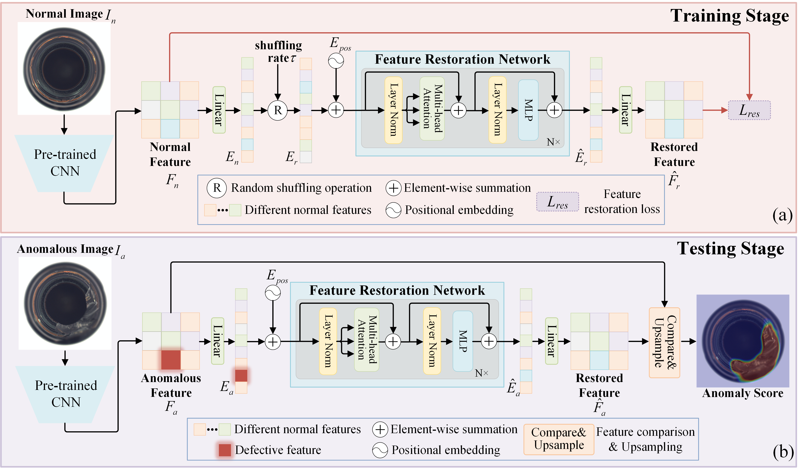

# [FSR: A feature shuffling and restoration strategy for universal unsupervised anomaly detection (KBS 2025)](https://www.sciencedirect.com/science/article/pii/S0950705125019124)
PyTorch implementation and for KBS2025 paper, A feature shuffling and restoration strategy for universal unsupervised anomaly detection.  
  


# Download Datasets
Please download MVTecAD dataset from [MVTecAD dataset](https://www.mvtec.com/de/unternehmen/forschung/datasets/mvtec-ad/) and BTAD dataset from [BTAD dataset](https://www.beantech.it/).
# Installation
[timm==0.3.2](https://github.com/huggingface/pytorch-image-models)     
[pytoch==1.8.1](https://pytorch.org/)
# Citation
If you find this repository useful, please consider citing our work:  
```
@article{luo2025feature,
  title={A feature shuffling and restoration strategy for universal unsupervised anomaly detection},
  author={Luo, Wei and Yao, Haiming and Qiang, Zhenfeng and Zhang, Xiaotian and Zhang, Weihang},
  journal={Knowledge-Based Systems},
  pages={114874},
  year={2025},
  publisher={Elsevier}
}
```

